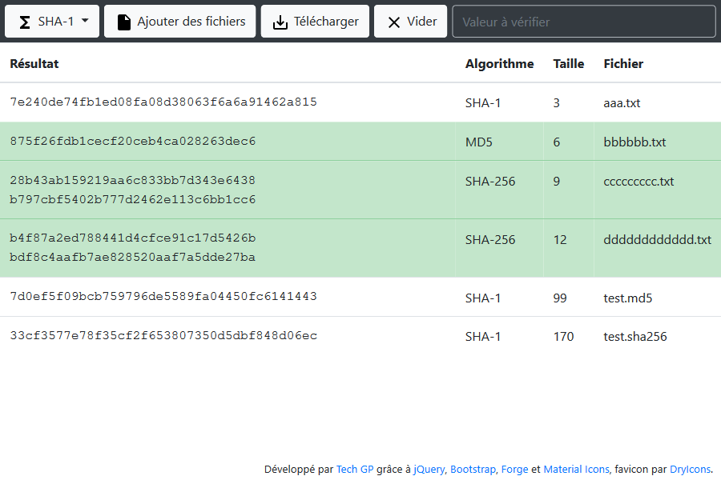

# webapps-digest

File integrity checker using MD5, SHA-1, SHA-256, SHA-384 &amp; SHA-512 digesters

## Présentation

[Cette application](https://techgp.fr:9005/webapps-digest/webapps-digest.html) écrite en HTML5, JavaScript et CSS3 vous permettra de [contrôler l'intégrité de fichiers](https://fr.wikipedia.org/wiki/Somme_de_contr%C3%B4le), par exemple lorsque ceux-ci sont téléchargés depuis Internet.

L'application supporte les algorithmes suivants :

- [MD5](https://fr.wikipedia.org/wiki/MD5)
- [SHA-1](https://fr.wikipedia.org/wiki/SHA-1)
- [SHA-256](https://fr.wikipedia.org/wiki/SHA-2)
- [SHA-384](https://fr.wikipedia.org/wiki/SHA-2)
- [SHA-512](https://fr.wikipedia.org/wiki/SHA-2)

Les librairies suivantes sont utilisées pour cette application :

- [Forge 0.9.1](https://github.com/digitalbazaar/forge)
- [jQuery 3.4.1](https://jquery.com/)
- [Bootstrap 4.4.1](https://getbootstrap.com/)
- [Popper 1.16.1](https://popper.js.org/), dépendance de Bootstrap 4
- [Material Icons](https://material.io/tools/icons) pour les boutons
- [DryIcons](https://dryicons.com/) pour le favicon

## Compilation de Forge

La version de `Forge` utilisée a été recompilée manuellement pour n'inclure que ce qui nous intéresse (MD5, SHA-1, SHA-256 et SHA-512)

- récupérer le repository

```bash
git clone --depth 1 --branch 0.9.1 https://github.com/digitalbazaar/forge.git
cd forge
```

- ajouter une cible webpack personnalisée dans `webpack.config.js` :

```javascript
const outputs = [

  {
    entry: ['./lib/md5.js', './lib/sha1.js', './lib/sha256.js', './lib/sha512.js', './lib/forge.js'],
    filenameBase: 'forge-custom-digest',
    libraryTarget: 'umd'
  }

];
```

- construire Forge

```bash
npm install
npm run build
```

Le résultat se trouve dans le dossier `dist`

## Captures d'écran

### Présentation générale


### Exemple de vérification manuelle d'un hash


### Support de vérification par fichiers de checksums



### Interface responsive et barre de progression


## Licence

Ce projet est distribué sous licence MIT, reproduite dans le fichier LICENSE ici présent.

## Changelog

2016-03-04
- première version

2016-03-07
- amélioration de l'interface sur téléphone mobile
- déploiement d'une version en production

2016-03-11
- affichage de la taille des fichiers

2016-03-18
- ajout du favicon

2016-04-10
- MAJ de Forge en verion 0.6.39 (corrige un problème de calcul erroné des hash)
- amélioration des performance sous Firefox et Chrome en lisant 10Mo à chaque boucle (utilisation de FileReader.readAsBinaryString)

2016-06-24
- ajout du support des fichiers de checksums (.md5, .sha1, ...)
- ajout d'une colonne affichant l'algorithme retenu pour chaque fichier (dépend des checksums trouvées dans les fichiers)
- détection dynamique du support du téléchargement via l'attribut a.download (indisponible sous IE)
- amélioration de la zone de recherche (plus réactive à l'agrandissement et alignée à droite)
- ajout de la section CHANGELOG dans le README
- mise à jour des captures d'écran
- mise à jour de jQuery en 2.2.4

2016-06-28
- ajout du fichier LICENCE

2016-09-09
- vérification de la présence du caractère "*" parfois présent devant le nom de fichier dans les fichiers de checksum

2017-01-07
- ajout de la possibilité de trier les résultats en cliquant sur les en-têtes de colonnes
- amélioration du nettoyage des noms de fichier dans les fichiers de checksums (retrait du chemin en + de '*')

2017-05-21
- mise à jour de jQuery (2.2.4 en 3.2.1), Bootstrap (3.3.6 en 3.3.7) et Forge (0.6.39 en 0.6.49)

2017-07-15
- vérification des checksums non sensible à la casse
- suppression de la partie liée à [Play](https://www.playframework.com/) dans README.md

2018-08-26
- mise à jour de Forge (0.6.49 => 0.7.6), recompilé manuellement avec une cible personnalisée pour "webpack"
- mise à jour de jQuery (3.2.1 => 3.3.1), Bootstrap Multiselect (0.9.13 => 0.9.15) et renommage de "bootstrap" en "bootstrap3"
- passage des liens externes en HTTPS

2019-05-03
- ajout de trace dans la console est cas de problème de lecture du fichier (ça arrive sur les gros fichier après quelque temps et aléatoirement)
- mise à jour de Forge (0.7.6 => 0.8.2), recompilé manuellement avec une cible personnalisée pour "webpack"
- mise à jour de jQuery (3.3.1 => 3.4.1)
- mise à jour README.md

2019-05-05
- migration vers Bootstrap 4, utilisation de Material Icons au lieu de Glyphicons et suppression de Bootstrap MultiSelect
- migration de ApplicationCache vers Service Worker 
- dans l'export, ne prendre en compte que les lignes dont l'algorithme correspond au fichier exporté

2019-05-06
- hachage des fichiers déplacé dans un "Worker" pour rendre l'IHM plus réactive
- lecture des fichiers avec "fetch / getReader()" plutôt que "FileReader" et de multiples "slice"

2020-04-08
- ajustement de la barre d'outils en flex pour mieux gérer la taille de la zone de recherche
- ajustement de l'ordre des colonnes et de la gestion des espaces dans la grille
- correction de l'ordre des colonnes dans le fichier exporté (les hash à gauche et les noms de fichiers à droite)
- correction de la lecture des fichiers de hash en cas d'espace dans le nom des fichiers
- mise à jour de Bootstrap (4.4.1), Popper (1.16.1) et Forge (0.9.1)
