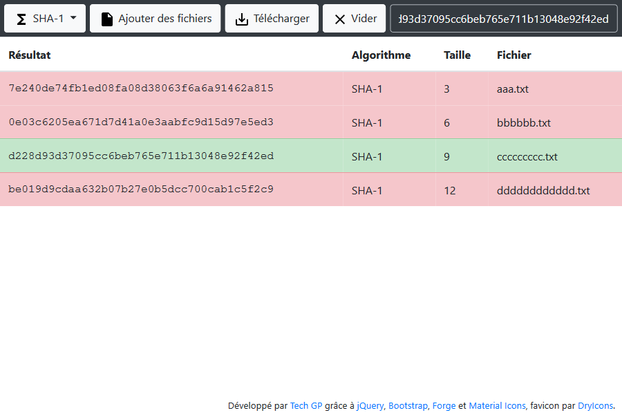

# webapps-digest

File integrity checker using MD5, SHA-1, SHA-256, SHA-384 &amp; SHA-512 digesters

## Présentation

[Cette application](./webapp/webapps-digest.html) écrite en HTML5, JavaScript et CSS3 vous permettra de [contrôler l'intégrité de fichiers](https://fr.wikipedia.org/wiki/Somme_de_contr%C3%B4le), par exemple téléchargés sur Internet.

L'application supporte les algorithmes suivants :

- [MD5](https://fr.wikipedia.org/wiki/MD5)
- [SHA-1](https://fr.wikipedia.org/wiki/SHA-1)
- [SHA-256](https://fr.wikipedia.org/wiki/SHA-2)
- [SHA-384](https://fr.wikipedia.org/wiki/SHA-2)
- [SHA-512](https://fr.wikipedia.org/wiki/SHA-2)

Les librairies suivantes ont été utilisées pour cette application :

- [jQuery 2.1.4](http://jquery.com/)
- [Bootstrap 3.3.6](http://getbootstrap.com/css/)
- [Forge 0.6.39](https://github.com/digitalbazaar/forge)
- [Bootstrap Multiselect 0.9.13](https://github.com/davidstutz/bootstrap-multiselect)

L'application est fournie avec un fichier manifest `webapps-digest.appcache` permettant la mise en cache et l'utilisation en mode déconnecté. Plus d'info chez Mozilla [en français](https://developer.mozilla.org/fr/docs/Utiliser_Application_Cache) ou [en anglais](https://developer.mozilla.org/en-US/docs/Web/HTML/Using_the_application_cache).

NB : quand le certificat HTTPS est incorrect, la mise en cache échouera sous Chrome avec l'erreur `Manifest fetch Failed (9)`. Dans ce cas, faites les tests en HTTP et/ou utilisez un certificat valide en production.

## Captures d'écran

### Présentation de l'IHM


### Exemple de recherche/comparaison



### Interface responsive et barre de progression


## Intégration à Play

Pour intégrer à [Play](https://www.playframework.com/), il faut :

1. Déposer les 4 fichiers dans le dossier `public`

    - webapps-digest.appcache
    - webapps-digest.css
    - webapps-digest.html
    - webapps-digest.js

2. Pour que la mise en cache se fasse, le type mime `text/cache-manifest` doit être renvoyé pour le fichier `appcache`. On ajoute donc une règle au fichier `routes`

    ```
    GET		/assets/webapps-digest.appcache		controllers.Application.manifest(path: String = "webapps-digest.appcache")
    ```

3. L'implémentation ressemble à ça :

    ```java
    public class Application extends Controller {

    	public final Result manifest(String path) {
    		return ok(Play.current().getFile("public/" + path)).as("text/cache-manifest");
    	}

    }
    ```
